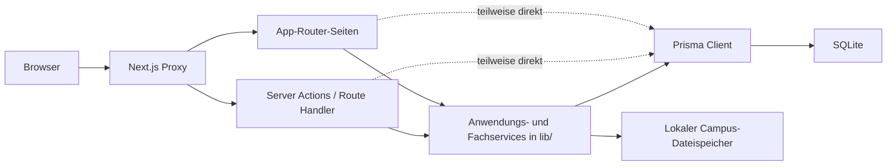

# Architektur – Istzustand

Stand: 27.07.2026  
Geprüfter Commit: `ec2b4d63badc040e58d372e99adfb7c79e9e47df`

## Kurzbewertung

Ordo Caroli ist ein lokal betriebener modularer Monolith auf Basis von Next.js App Router, TypeScript, Prisma und SQLite. Die Anwendung besitzt bereits belastbare Fachlogik, serverseitige Berechtigungsprüfungen, Aufgaben-Snapshots, fachliche Verläufe und einen umfangreichen automatisierten Testbestand. Die Modulgrenzen sind jedoch überwiegend konventionell und noch nicht technisch abgesichert.

Ein Neustart ist nicht erforderlich. Vor einem weiteren großen Modul ist ein begrenztes Plattform-Refactoring erforderlich.

## Technischer Bestand

| Bereich | Befund |
|---|---|
| Laufzeit | Node.js 24.18.0 LTS, npm 11.16.0 |
| Webframework | Next.js 16.2.12, React 19.2.4, App Router |
| Sprache | TypeScript 5.9.3, `strict: true` |
| Oberfläche | React Server Components, 16 Client-Komponenten, Tailwind CSS 4 und zentrale CSS-Tokens |
| Datenzugriff | Prisma ORM 6.19.3 |
| Datenbank | lokale SQLite-Datei |
| Validierung | Zod und zusätzliche fachliche Regelfunktionen |
| Authentifizierung | lokale Konten, scrypt, opake serverseitige Sitzungen |
| Tests | Vitest, sequenzielle dateibasierte Testdatenbank |
| Umfang | 44 `page.tsx`-Dateien, 9 Server-Action-Dateien, 6 Route Handler, 34 Prisma-Modelle, 15 Migrationen |

## Laufzeitarchitektur

## Schichten und Verantwortlichkeiten

### Präsentation

- `app/` enthält Routen, Server Components, Formulare und Client-Interaktionen.
- Die meisten Daten werden serverseitig geladen.
- Client-Komponenten werden gezielt für Toasts, Panels, Tabellenzeilen und dynamische Formfelder genutzt.
- `proxy.ts` leitet Anfragen ohne Sitzungscookie zur Anmeldung um. Die eigentliche Sitzungsprüfung erfolgt anschließend serverseitig.

### Anwendung und Fachlogik

- `lib/monthly-checklist-service.ts` bündelt den Monatsworkflow, ist mit über 1.000 Zeilen jedoch zu groß.
- `lib/annual-checklist-service.ts` bündelt den Jahresabschlussworkflow.
- `lib/checklist-workflow-rules.ts` enthält gemeinsame Abschlussregeln.
- `lib/task-execution-planning.ts` enthält die Rhythmuslogik.
- `lib/client-service.ts`, `lib/standard-task-service.ts`, `lib/ordo-campus-service.ts` und weitere Dateien bilden erkennbare fachliche Dienste.

### Datenzugriff

- Services verwenden Prisma direkt und Transaktionen an wichtigen Schreibgrenzen.
- Zahlreiche Seiten und einzelne Actions greifen ebenfalls direkt auf Prisma zu.
- Dadurch sind Leseabfragen pragmatisch, aber Modulgrenzen, Autorisierung und wiederverwendbare Abfragekonzepte nicht durchgehend erzwungen.

## Authentifizierung und Sitzungen

- Passwörter werden mit Node.js `scrypt`, individuellem Salt und zeitkonstantem Vergleich verarbeitet.
- Das Browsercookie enthält ein zufälliges Token; gespeichert wird nur dessen SHA-256-Hash.
- Sitzungen laufen nach acht Stunden ab und besitzen eine `sessionVersion`.
- Deaktivierung oder Passwortänderung kann Sitzungen serverseitig ungültig machen.
- Cookie: `HttpOnly`, `SameSite=Lax`; im Produktionsmodus `Secure`.
- Ein CSRF-Basisschutz ist für Import-Endpunkte als Same-Origin-Prüfung vorhanden, jedoch nicht als einheitliche Richtlinie für alle schreibenden Endpunkte.

## Berechtigungen

- Rollen und Zusatzberechtigungen werden als Werte in `UserRole` gespeichert.
- Fachliche Checks liegen zentral in `lib/permissions.ts`.
- Objektbezogene Rechte verwenden Benutzerreferenzen an Mandant oder Checkliste.
- Server Actions und Route Handler prüfen Berechtigungen überwiegend serverseitig.
- Einschränkung: Rollen und Berechtigungen sind im selben String-Modell vermischt; Organisations-, Modul- und Mandanten-Scopes fehlen.

## Dateien und Konfiguration

- Campus-Anhänge liegen unter `storage/ordo-campus` oder einem konfigurierten lokalen Pfad.
- Metadaten liegen in der Datenbank; Dateiname und Storage-Key werden serverseitig erzeugt.
- Signatur, Dateiendung, MIME-Typ und 15-MB-Grenze werden geprüft.
- Datenbank, Anhänge, `.env`, Builds und temporäre Dateien sind von Git ausgeschlossen.
- Konfiguration ist noch auf `.env`, Codekonstanten und `package.json#prisma` verteilt.

## Migrationen und Seeds

- 13 additive SQL-Migrationen sind vorhanden und werden in Tests geordnet auf eine frische Datenbank angewendet.
- Der deterministische Seed besitzt eine Konsistenzprüfung.
- Kritischer Istbefund: `prisma migrate status` meldet für `prisma/dev.db` alle 15 Migrationen als nicht angewendet. Das Schema ist vorhanden, die Migrationshistorie der aktiven Entwicklungsdatenbank wurde offenbar früher über `db push` beziehungsweise direkte SQL-Ausführung aufgebaut.
- Deshalb darf die aktive Datenbank weder ungeprüft zurückgesetzt noch mit `migrate deploy` behandelt werden. Zuerst ist eine kontrollierte Baseline erforderlich.

## Tragfähige Bestandteile

- fachliche Monats- und Jahresabschlussworkflows,
- Status- und Abschlussregeln,
- Aufgaben- und Rollen-Snapshots,
- Jahresprofile und Ausführungsrhythmen,
- Ordo Campus als zentrale Wissensquelle,
- lokale Authentifizierung als Pilotgrundlage,
- serverseitige Objektberechtigungen,
- deterministische Testdaten und breite Regressionstests.

## Begrenzungen

- keine technisch erzwungenen Modulgrenzen,
- kein Organisationsobjekt,
- Benutzerkonto und Mitarbeiterprofil sind dasselbe Objekt,
- keine mandanten- oder organisationsbezogenen Berechtigungs-Scopes,
- SQLite und lokale Dateispeicherung,
- keine optimistische Sperre oder einheitliche Konflikterkennung,
- mehrere unpaginierte Listen und In-Memory-Filter,
- mehrere voneinander getrennte Verlaufsmodelle,
- keine einheitliche Sicherheitsprotokollierung,
- keine produktionsfähige Betriebs-, Backup- und Monitoringautomatisierung.
