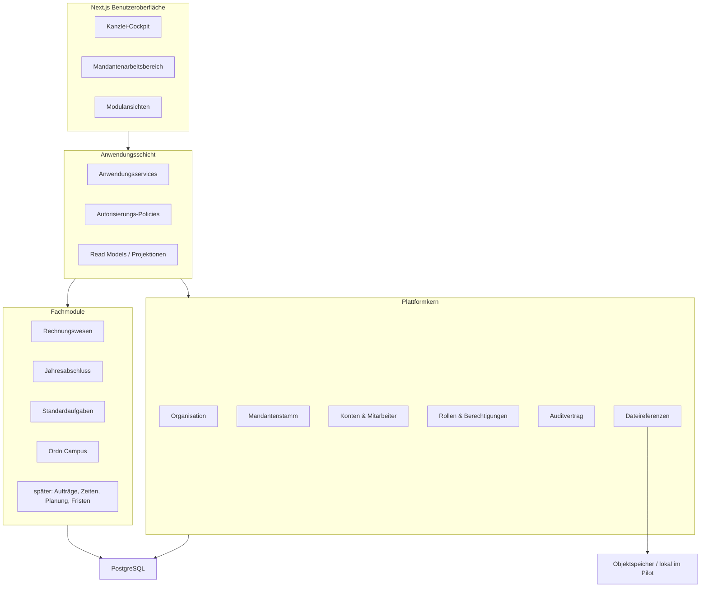

# Zielarchitektur Kanzlei Operating System

## Leitentscheidung

Ordo Caroli wird als modularer Monolith weiterentwickelt. Die heutige Anwendung bleibt der fachliche Kern. Ein kompletter Neustart, Microservices oder eine generische Workflowplattform sind nicht erforderlich.

## Zielbild



## Anwendungsschicht

Empfohlener Aufruf:

```text
UI -> Server Action/Route -> Application Service
   -> Policy -> Domain Rules -> Prisma
```

- Pages dürfen modulbezogene Read Models verwenden.
- Schreibende UI-Dateien enthalten keine Fachregeln.
- Ein Anwendungsservice besitzt die Transaktionsgrenze.
- Domain Rules sind reine Funktionen mit Unit-Tests.

## Plattformkern

Siehe `PLATTFORMKERN_ZIELBILD.md`. Vor allem Organisation, Mandantenidentität, Mitarbeiter/Konto-Trennung, Scopes und Audit bilden die Basis für alle späteren Module.

## Fachmodule

- Rechnungswesen und Jahresabschluss behalten ihre heutigen Statusmodelle.
- Standardaufgaben bleiben führende Aufgabenquelle.
- Campus bleibt an Standardaufgaben gebunden.
- Neue Module verwenden zentrale Identitäten, erfinden aber keine neue Benutzer-, Mandanten- oder Dateistruktur.

## Datenbankstrategie

- SQLite für lokalen Pilot und Abnahme.
- Migrationsbaseline sofort stabilisieren.
- PostgreSQL-Prototyp nach Vorbereitung des Plattformkerns.
- PostgreSQL vor breitem Mehrbenutzerbetrieb.
- Transaktionen, Versionsspalten und Pagination verbindlich.

## Dateispeicherstrategie

- Campus lokal im Pilot.
- gemeinsamer Dateireferenzvertrag vor weiteren Dateiarten.
- Objektdateispeicher, Malwareprüfung und zeitlich begrenzte Downloads vor Portalbetrieb.

## Berechtigungsstrategie

- Rolle, Berechtigung, Funktion und Scope unterscheiden.
- serverseitige Policy je Anwendungsfall.
- interne und externe Identitäten strikt trennen.
- reine Administratorrolle verleiht keine fachliche Freigabe.

## Auditstrategie

- bestehende Fachverläufe erhalten,
- gemeinsamer append-only Auditvertrag für neue Querschnittsaktionen,
- Sicherheits- und Revisionsaudit getrennt bewerten.

## Mehrbenutzerbetrieb

- PostgreSQL,
- optimistische Versionierung,
- bedingte Statusupdates,
- Konfliktmeldung,
- zentraler Betrieb und Backups,
- Monitoring und geregeltes Deployment.

## Integrationsstrategie

DATEV, DMS oder andere Systeme werden später über klar abgegrenzte Adapter angebunden. Fachmodule erhalten keine direkten SDK-Aufrufe. Synchronisationen benötigen externe Schlüssel, Idempotenz und Integrationsprotokolle.

## Navigation

```text
Übersicht
Mandanten
Rechnungswesen
Jahresabschluss
Ordo Campus

später:
Aufträge
Zeiten
Planung
Fristen
Dokumente

Administration
```

Der bestehende Mandant wird zum Arbeitskontext mit untergeordneten Modulansichten. Das heutige Dashboard bleibt als Rechnungswesen-Modulansicht erhalten und wird später in ein Kanzlei-Cockpit eingebettet.

## Teststrategie

- reine Domänenregeln als schnelle Unit-Tests,
- Services gegen echte temporäre Datenbank,
- Autorisierungstests für jede Schreibaktion,
- Migrationstests: leer, Vorgängerdatenbank, Produktionskopie,
- Browser-Smoke-Tests für Kernwege,
- PostgreSQL-Testlauf vor Umstellung.

## Betriebsstrategie

Lokaler Pilot, zentraler interner Betrieb und Internetbetrieb sind drei getrennte Reifestufen. Jede Stufe besitzt eigene Sicherheits-, Backup-, Monitoring- und Freigabekriterien.

