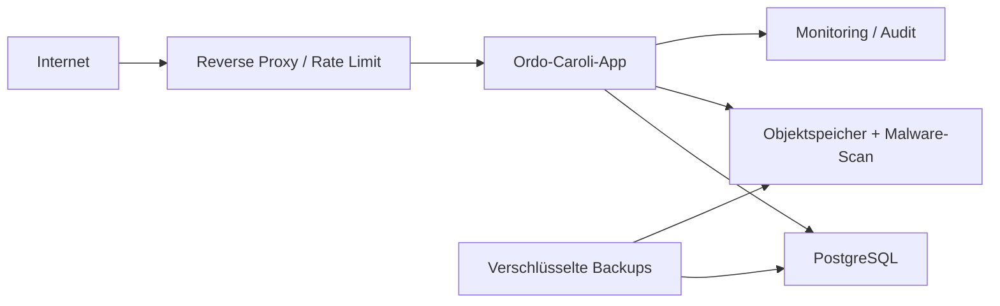

# Internetbereitstellung – Zielbild

## Ausgangslage

Der heutige lokale Betrieb über HTTP ist kein Internetbetrieb. Die vorhandene Anmeldung und Autorisierung sind eine gute Anwendungsbasis, ersetzen aber keine abgesicherte Betriebsumgebung.

## Vor internem Netzwerkbetrieb

- zentraler Server statt Arbeitsplatzrechner,
- PostgreSQL,
- HTTPS auch intern,
- geregelte Backups und Wiederherstellungstests,
- Betriebskonto mit minimalen Rechten,
- Monitoring von Verfügbarkeit, Fehlern, Speicher und Sicherungen,
- Concurrency-Schutz,
- Patch- und Releaseprozess,
- zentrale Protokollierung ohne Geheimnisse.

## Vor Internetbetrieb zwingend

- Reverse Proxy oder vergleichbare sichere TLS-Terminierung,
- vertrauenswürdige HTTPS-Zertifikate und HSTS,
- MFA für interne und externe Konten,
- Rate Limiting und Schutz gegen Credential Stuffing,
- sichere Passwortzurücksetzung,
- konsequenter CSRF-Schutz für alle schreibenden Browseraktionen,
- Security Header und Content Security Policy,
- abgesicherte Uploadstrecke mit Quarantäne und Malwareprüfung,
- Objektdateispeicher statt lokalem Ordner,
- externe Identitäten und strikte Mandantenscopes,
- zentrale Secrets-Verwaltung,
- Datenschutz-, Aufbewahrungs- und Löschkonzept,
- Notfall-, Incident- und Wiederanlaufplan,
- externer Sicherheitstest vor Freigabe.

## Referenzbetrieb

## Externe Identitäten

Mandantenportal-Zugänge werden getrennt von Mitarbeiterkonten geführt. Jede Anfrage wird auf Organisation, Mandant, Ressource und Aktion geprüft. Eine Benutzer-ID oder Rolle aus Query, Cookie-Payload oder Formular ist niemals vertrauenswürdig.

## Abgrenzung

Diese Dokumentation ist kein Penetrationstest und keine Produktionsfreigabe.

