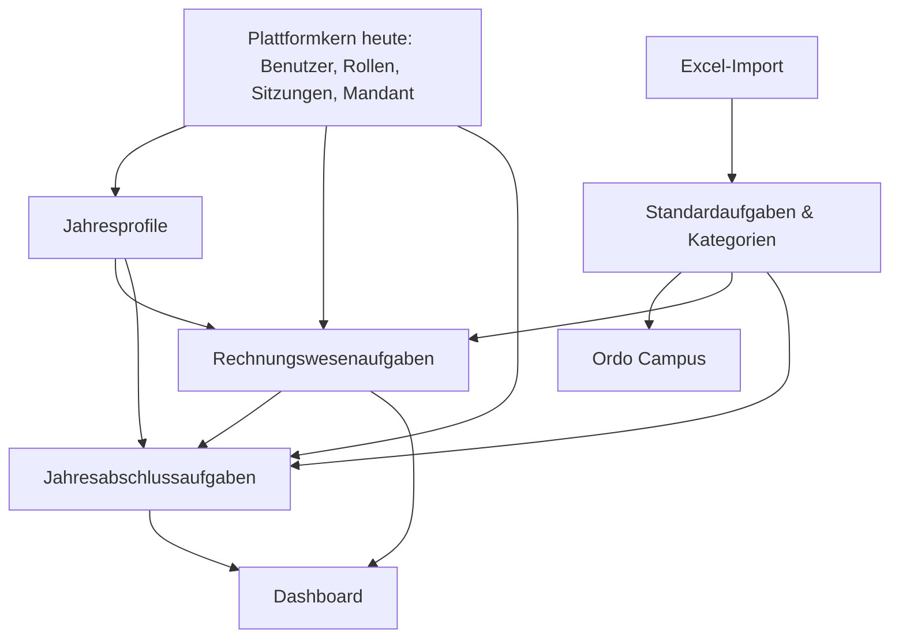

# Modulabhängigkeiten

## Heutige fachliche Module



## Erlaubte Zielabhängigkeiten

- Fachmodule dürfen den Plattformkern verwenden.
- Dashboard darf lesend auf Modul-Projektionen zugreifen.
- Jahresabschluss darf definierte Monatsübersichten lesen, aber keine Monatsdaten ändern.
- Campus gehört fachlich zu Standardaufgaben und wird über eine schmale Leseschnittstelle in Checklisten angezeigt.
- Import darf ausschließlich Standardaufgaben und Kategorien ändern.
- Fachmodule dürfen nicht direkt Tabellen eines anderen Moduls schreiben.

## Heutige Grenzverletzungen oder enge Kopplungen

- Jahresabschluss lädt Monatsaufgaben direkt über Prisma.
- Dashboard lädt vollständige Monats- und Jahresabschlussobjekte und berechnet Projektionen im Prozess.
- Seiten greifen direkt auf Prisma-Modelle verschiedener Module zu.
- `User` und `Client` sind gleichzeitig Plattformkern und fachliche Zuordnungsobjekte.
- ein einziges Prisma-Schema macht Eigentumsgrenzen nicht sichtbar.

## Empfohlene Verzeichnisstruktur

```text
src/
  platform/
    identity/
    organization/
    authorization/
    audit/
    files/
  modules/
    clients/
    standard-tasks/
    campus/
    accounting/
    annual-closing/
  read-models/
    dashboard/
```

Eine physische Umstellung ist nicht sofort erforderlich. Zuerst werden Eigentümer, öffentliche Service-Schnittstellen und Importregeln dokumentiert; Dateien werden nur bei fachlicher Änderung verschoben.

## Spätere Module

`Aufträge`, `Zeiten`, `Planung`, `Fristen` und `Dokumente` referenzieren den Plattformkern und den Mandanten. Sie dürfen nicht von Checklistenmodellen abhängig gemacht werden. Ein späterer Auftrag kann Checklisten oder Zeiten referenzieren, aber die fachlichen Workflows bleiben eigenständige Module.

