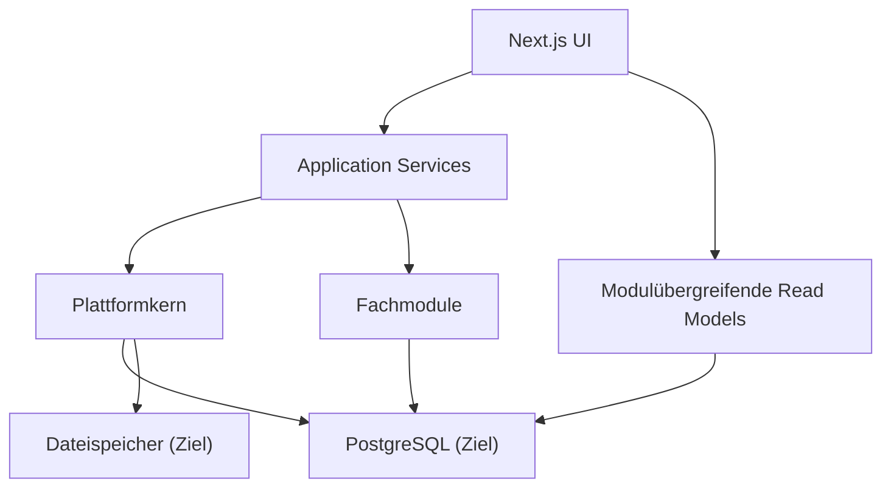

# Plattformkern – Zielbild

## Zweck

Der Plattformkern stellt nur Funktionen bereit, die mehrere Fachmodule wirklich gemeinsam benötigen. Er ersetzt keine Fachmodule und wird keine allgemeine Workflowengine.

## Bestandteile

1. **Organisation**
   - Kanzleiidentität, Zeitzone, Sprache und zentrale Einstellungen.
2. **Mandantenstamm**
   - stabile Mandanten-ID, Nummer, Name, Status und Organisationszuordnung.
3. **Identität**
   - Benutzerkonto, Mitarbeiterprofil und später externe Identität getrennt.
4. **Autorisierung**
   - Rollen, Berechtigungen, Scopes und objektbezogene Policies.
5. **Audit**
   - gemeinsamer Ereignisvertrag für sicherheits- und geschäftsrelevante Aktionen.
6. **Dateireferenz**
   - Metadaten, Speicheranbieter, Prüfsumme und Zugriffspolicy; fachliche Dokumente bleiben im jeweiligen Modul.
7. **Gemeinsame Konventionen**
   - Europe/Berlin, UTC-Speicherung, IDs, Fehlercodes, Archivstatus und Pagination.

## Nicht Bestandteil

- universelle Aufgaben- oder Workflowengine,
- dynamische No-Code-Modelle,
- Microservices,
- Event-Sourcing,
- Kubernetes,
- mandantenspezifische Datenbanken.

## Zielstruktur



## Organisationsmodell

Vor dem nächsten großen Modul wird ein einzelner `Organization`-Datensatz empfohlen. Neue plattformweite Modelle erhalten `organizationId`. Bestehende Daten werden additiv diesem Datensatz zugeordnet. Eine SaaS-Mandantenfähigkeit wird damit nicht behauptet.

## Identitätsmodell

```text
UserAccount 1 -- 0..1 Employee
UserAccount 1 -- n Session
Employee n -- 1 Organization
Employee 1 -- n RoleAssignment
ExternalIdentity n -- 1 Client (später)
```

Historische Snapshots speichern weiterhin Namen. Neue fachliche Datensätze referenzieren nach der Übergangsphase `Employee`, sicherheitsrelevante Aktionen zusätzlich `UserAccount`.

## Fachmodule

- Mandanten und Jahresprofile
- Standardaufgaben und Import
- Ordo Campus
- Rechnungswesen
- Jahresabschluss
- spätere Aufträge, Zeiten, Planung, Fristen und Dokumente

Jedes Modul besitzt:

- eigene Anwendungsservices,
- eigene Domänenregeln,
- eigene Prisma-Modelle oder klar markierten Schemaabschnitt,
- eigene Tests,
- öffentliche Lese- und Schreibschnittstellen.

## Aufträge und Zeiten – nur architektonische Vorbereitung

Vor einem späteren Zeitmodul genügt:

```text
WorkItem/Order: organizationId, clientId, type, year, status
TimeEntry: organizationId, employeeId, optional clientId, optional orderId,
           workDate, durationMinutes, description
```

Keine fachlichen Status, Budgets oder Abrechnung in diesem Auftrag festlegen. Wichtig ist nur, dass Mitarbeiter, Mandant und Organisation vorher stabile Plattformidentitäten sind.

